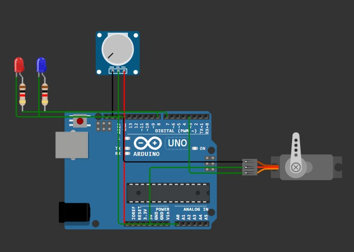
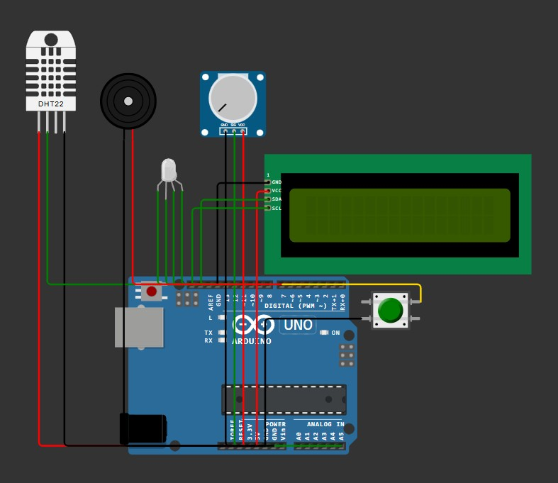
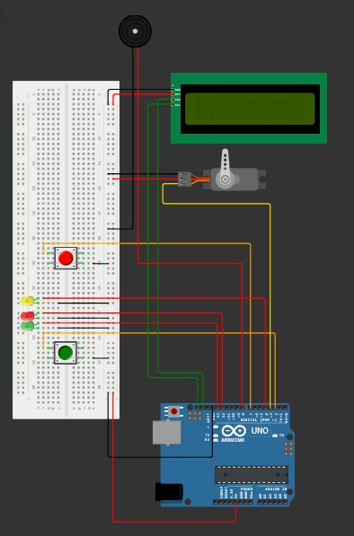

### Task 1
#### Determine Servo Motor Region
- Use enum class as state.
- For servo you need to import the servo library and add this include `Servo.h`
- Here is how to setup the serial, pins and servo.
- First create a global variable for your servo `Servo servo;`
```c
void setup() {
  Serial.begin(9600);
  servo.attach(SERVO_PIN);
  pinMode(RED_PIN, OUTPUT);
  pinMode(BLUE_PIN, OUTPUT);
}

// in the main loop to feed the value to servo use this
servo.write(angle);
```
#### potentiometer
This device is connected to the Analog pins which go from 0 to 1023 depending on the value, it is up to you to convert this into angle by using the `map` function.
```c
const int POT_PIN = A0;

// in the main loop read the analog value
const int potValue = analogRead(POT_PIN);
// convert it to angle
const int angle = map(potValue, 0, 1023, 0, 180);
```
#### Nearly Equal
Here is my custom implementation of nearly equal function:
```c
bool nearlyEqual(const int A, const int B, const int D) {
  int value = abs(A - B);
  if(value < D) {
    return true;
  }
  return false;
}
```


---

### Task 2
Moving onto non-blocking loop, here each component has its own update rate which is kept track of by a timer variable.
```c
  unsigned long now = millis();
  if(now - prevPotTime >= timerPot) {
    taskReadPot();
    prevPotTime += timerPot;
  }
```
---

### Task 3
In this task we create a cooperative task schedular, objective is to create a thermostat that does the following things
- Read temperature, use potentiometer to set max temperature limit.
- Set LED to correct lighting mode based on its state.
- Display temperature and limit on LCD.
- Use Button to switch between Celsius and Fahrenheit.
#### Task Schedular
```c
struct Task {
  unsigned long prev;
  unsigned long period;
  void (*func)();
}; 

Task tasks[] = {
  {0, 50, readPotMeter},
  {0, 2000, readTemp},
  {0, 500, refreshLCD},
  {0, 500, blinkLED},
  {0, 50, buzzer},
  {0, 10, button}
};
```
In the main loop you simply iterate over the task array.
```c
  for(auto& task : tasks) {
    if(now - task.prev >= task.period) {
      task.prev += task.period;
      task.func();
    }
  }
```
#### Setup LCD
We are using I2C LCD in this prototype as it is a bit easier to connect.
- Import the library for LCD I2C.
- Include `#include <LiquidCrystal_I2C.h>`
- Define address `const int I2C_ADDR = 0x27;`
- Create a global LCD variable `LiquidCrystal_I2C lcd(I2C_ADDR, 16, 2);`
- 16 is the number of columns and 2 is the number of rows.
- Setup
```c
  lcd.init();
  lcd.backlight();
```
- Display
```c
  lcd.setCursor(0, 0);
  lcd.print("Temp: ");
  lcd.print(temp);
  lcd.print(showTempInC ? " C" : " F");
  lcd.setCursor(0, 1);
  lcd.print("Limit: ");
  lcd.print(limit);
  lcd.print(showTempInC ? " C" : " F");
```
- To clear your LCD display use this
```c
lcd.clear();
```
#### Setup DHT
This component is used for measuring temperature, you need its library and include file `#include <DHT.h>`
- Create global DHT variable `DHT dht(DHT_PIN, DHT22);`
- In the main setup function use this to initialize: `dht.begin();`
- You can now read the values like this in code:
```c
  tempC = dht.readTemperature();
  tempF = dht.readTemperature(true);
  humid = dht.readHumidity();
```
>When you send in `true` in read temperature function it will return in Fahrenheit.
#### Buzzer
Define the pin and duration.
```c
const int BUZZER_PIN = 4;
const unsigned long BUZZER_DURATION = 100;
```
For state management also define these:
```c
unsigned long buzzerStartTime = 0;
bool buzzerActive = false;
```
Rest is easy
```c
void buzzer() {
  if (currentState != prevState) {
    digitalWrite(BUZZER_PIN, HIGH);
    buzzerStartTime = millis();
    buzzerActive = true;
    prevState = currentState;
  }
  
  if (buzzerActive && (millis() - buzzerStartTime >= BUZZER_DURATION)) {
    digitalWrite(BUZZER_PIN, LOW);
    buzzerActive = false;
  }
}
```


---

### Task 4
In this task we created a door system, that has a few states and an emergency button which if pressed will open the door no matter which state it was in currently.
Create a debounced button class for ease of use.
```c
enum class ButtonEvent
{
  Unhandled,
  Handled
};

struct DebouncedButton {
  int state;
  int last_state;
  unsigned long last_time;
  const unsigned long delay;
  ButtonEvent event_state = ButtonEvent::Handled;
  
  // Constructor
  DebouncedButton(unsigned long d = 50) :
  state(HIGH),
  last_state(HIGH),
  last_time(0),
  delay(d) {}
  
  // returns valid when LOW is detected
  bool update(int current_reading) {
    bool triggered = false;
    // If the switch changed, due to noise or pressing:
    if (current_reading != last_state) {
      last_time = millis();
    }

    if ((millis() - last_time) > delay) {
      // If the state has changed and it's been stable longer than the delay
      if (current_reading != state) {
        state = current_reading;
        // Only trigger if the new state is LOW (assuming pull-up resistor)
        if (state == LOW) {
          triggered = true;
        }
      }
    }
    
    last_state = current_reading;
    return triggered;
  }
};
```
Create 2 global variables for these buttons
```c
DebouncedButton red_btn(50);
DebouncedButton green_btn(50);
```
In the main setup function connect your buttons with pin modes
```c
  // buttons
  pinMode(G_BTN_PIN, INPUT_PULLUP);
  pinMode(R_BTN_PIN, INPUT_PULLUP);
```
In the loop check if they were triggered, if yes then set the event state to unhandled so you process the button press when button tasks are executed.
In Loop:
```c
  int red_value = digitalRead(R_BTN_PIN);
  int green_value = digitalRead(G_BTN_PIN);

  if (red_btn.update(red_value)) {
    red_btn.event_state = ButtonEvent::Unhandled;
  }

  if (green_btn.update(green_value)) {
    green_btn.event_state = ButtonEvent::Unhandled;
  }
```
Then in task you can simply check if the event is unhandled or not
```c
void process_sensor() {
  if (red_btn.event_state == ButtonEvent::Handled) {
    return;
  }

  // mark this press as handled
  red_btn.event_state = ButtonEvent::Handled;
  // invalidate the green button as well
  green_btn.event_state = ButtonEvent::Handled;
  
  if (cur_door_state == DoorState::Closing) {
    cur_door_state = DoorState::Opening;
    tar_door_state = DoorState::Open;
    Serial.println("Sensor detected something, force opening door!");
  }
}
```


---

### Task 5
In this we make a simple CLI or Console if you are a gamer, we add a few commands and compare strings, break them into tokens and get values as parameters.
But first we create a ring buffer in which we will store our characters that come from console.
```c
const int BUFFER_SIZE = 64;

struct RingBuffer
{
  char buffer[BUFFER_SIZE];
  size_t head = 0;
  size_t tail = 0;
  size_t count = 0;
  bool full = false;

  void push(char c)
  {
    if (full)
    {
      tail = (tail + 1) % BUFFER_SIZE;
    }
    else
    {
      ++count;
    }
    buffer[head] = c;
    head = (head + 1) % BUFFER_SIZE;
    full = (head == tail);
  }
  
  bool pop(char &c)
  {
    if (empty())
    {
      return false;
    }
    c = buffer[tail];
    full = false;
    tail = (tail + 1) % BUFFER_SIZE;
    --count;
    
    return true;
  }
  
  bool empty()
  {
    return (!full && (head == tail));
  }
};
```
Our global variables
```c
RingBuffer console_buffer{};
int incoming_byte = 0;
size_t command_size = 0;
char command[BUFFER_SIZE];
bool is_led_on = false;
```
#### Read Characters
```c
void loop()
{
  while (Serial.available())
  {
    incoming_byte = Serial.read();
    if (incoming_byte == '\n' || incoming_byte == '\r')
    {
      command_size = console_buffer.count;
      for (auto i = 0; i < command_size; ++i)
      {
        console_buffer.pop(command[i]);
        command[i] = tolower(command[i]);
      }

      command[command_size] = '\0';
      process_command();
      memset(command, 0, BUFFER_SIZE);
    }
    else
    {
      console_buffer.push(incoming_byte);
    }
  }
}
```
You keep reading the incoming bytes until you hit an end-line.
- Copy the buffer one by one to command array in lower case.

---

## Task 6
Let's see how interrupts work in Arduino, we will have one button that will trigger an interrupt which will increment the event counter that will be handled by our task scheduler.  
Here is how you can define an interrupt in Arduino, In the UNO version there are only 2 pins that support interrupts.
```c
// In Arduino only pin 2 and 3 (INT 0) and (INT 1) can have interrupts.
const int BTN_PIN = 2;

volatile int doorbell_trigger_count = 0;

// In your setup function
pinMode(BTN_PIN, INPUT_PULLUP);
// 0 is INT 0: Digital pin 2, button_pressed is our callback, FALLING is our trigger
// you can directly type 0 or 1 in the first parameter
attachInterrupt(digitalPinToInterrupt(BTN_PIN), button_pressed, FALLING);
```
Remember to keep very simple code in ISR, also the reason ISR exist is so you can have your device in low power mode, Arduino has an include for this called `lowpower`.

